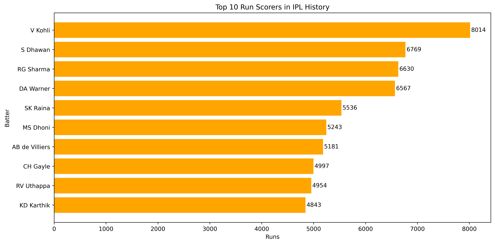
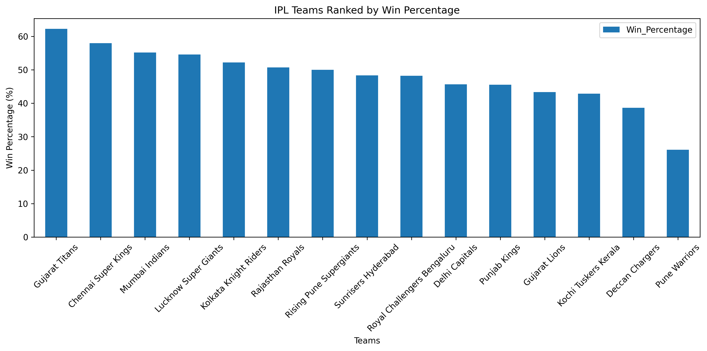
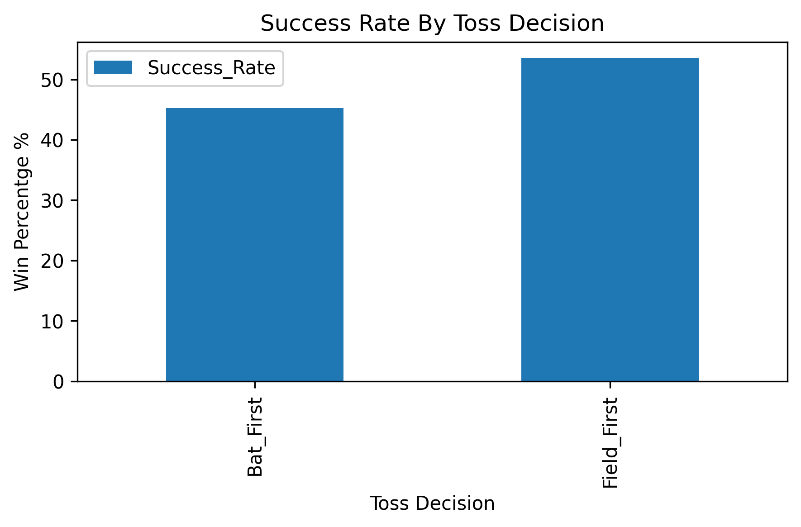
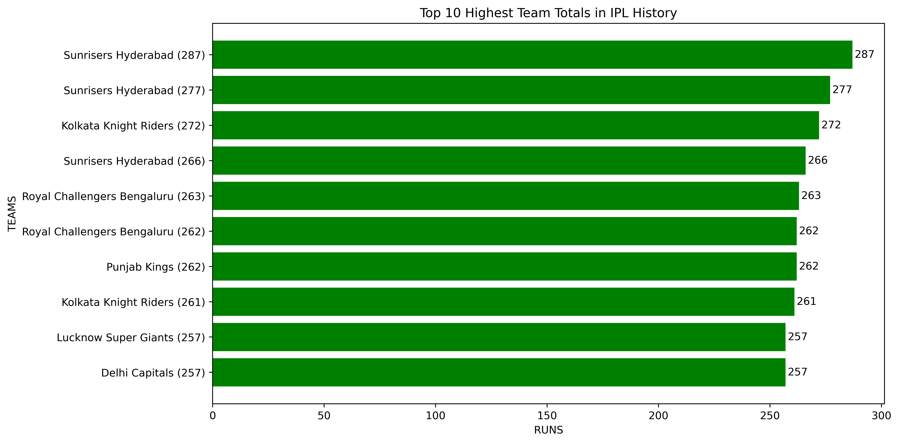

# 🏏 IPL Data Analysis (2008–2023)

An Exploratory Data Analysis (EDA) project on Indian Premier League (IPL) data using Python, Pandas, Matplotlib, and Seaborn.

This project analyzes 15+ years of IPL matches to uncover patterns related to team performance, batting trends, toss impact, venue influence, player achievements, and match outcomes.

---

## 📌 Project Overview

The Indian Premier League (IPL) is one of the world's most competitive T20 cricket leagues. This project explores historical IPL data to answer important questions such as:

- Which teams have dominated the IPL?
- Does winning the toss significantly affect match results?
- How has batting evolved over the years?
- Which players have had the greatest impact?
- Which venues are the highest scoring?
- What are the most thrilling matches in IPL history?

The objective is to transform raw cricket data into meaningful insights through data analysis and visualization.

---

## 🎯 Objectives

- Analyze team performance across seasons
- Study toss impact on match outcomes
- Identify top-performing batsmen and bowlers
- Explore venue-wise scoring trends
- Examine batting evolution over time
- Discover interesting match statistics and records

---

## 🛠️ Technologies Used

- Python
- Pandas
- NumPy
- Matplotlib
- Seaborn
- Jupyter Notebook

---

## 📂 Dataset

The project uses IPL historical datasets:

### Matches Dataset
Contains:
- Match ID
- Teams
- Venue
- Toss details
- Match winner
- Season information

### Deliveries Dataset
Contains:
- Ball-by-ball information
- Runs scored
- Wickets
- Batsman and bowler details
- Match events

---

## 📊 Analysis Performed

### Team Performance Analysis
- Team win percentages
- Most successful IPL teams
- Highest team totals

### Batting Analysis
- Top run scorers
- Highest individual scores
- Team batting trends

### Bowling Analysis
- Top wicket takers
- Bowling impact analysis

### Toss Analysis
- Toss win vs match win comparison
- Toss decision patterns

### Venue Analysis
- Highest scoring venues
- Venue-wise run distribution

### Match Insights
- Closest IPL matches
- Largest victories
- Historic IPL records

---

## 🏆 Key Findings

### Team Insights
- Certain franchises have consistently maintained high win percentages across multiple seasons.
- Team totals have increased significantly over the years due to aggressive T20 batting strategies.

### Toss Impact
- Winning the toss provides only a moderate advantage.
- Team strength generally has a greater impact on match results than toss outcomes.

### Batting Insights
- Virat Kohli ranks among the highest run scorers in IPL history.
- The IPL has witnessed a steady rise in batting strike rates and scoring rates.

### Bowling Insights
- Yuzvendra Chahal is among the leading wicket-takers in IPL history.
- Successful teams often combine strong batting depth with effective bowling attacks.

### Venue Insights
- Certain venues consistently produce higher scoring matches.
- Ground dimensions and pitch conditions significantly influence scoring patterns.

---

## 📈 Visualizations

The project includes:

- Bar Charts
- Horizontal Bar Charts
- Line Charts
- Trend Analysis
- Team Rankings
- Venue Comparisons
- Season-wise Performance Analysis

---

## 📷 Sample Visualizations

### Top Run Scorers


### Team Win Percentage


### Toss Impact


### Highest Team Totals


---

## 📁 Repository Structure

```text
IPL-EDA-Analysis/
│
├── Data/
│   ├── matches.csv
│   └── deliveries.csv
│
├── Images/
│   ├── team_win_percentage.png
│   ├── top_10_run_scorers.png
│   ├── toss_impact.png
│   └── ...
│
├── Notebook/
│   └── IPL_EDA_Analysis.ipynb
│
├── README.md
└── requirements.txt
```

---

## ▶️ How to Run

### Clone Repository

```bash
git clone https://github.com/may7jha/IPL-EDA-Analysis.git
```

### Navigate to Project

```bash
cd IPL-EDA-Analysis
```

### Install Dependencies

```bash
pip install -r requirements.txt
```

### Launch Jupyter Notebook

```bash
jupyter notebook
```

Open:

```text
Notebook/IPL_EDA_Analysis.ipynb
```

---

## 🚀 Future Improvements

- Build IPL match winner prediction models
- Apply Machine Learning algorithms
- Analyze player strike rates and economy rates
- Create interactive dashboards using Power BI/Tableau
- Develop advanced cricket analytics metrics

---

## 👨‍💻 Author

**Mayank Jha**

- LinkedIn: www.linkedin.com/in/mayank-jha-30801823b
- GitHub: github.com/may7jha

---

⭐ If you found this project useful, consider giving it a star.